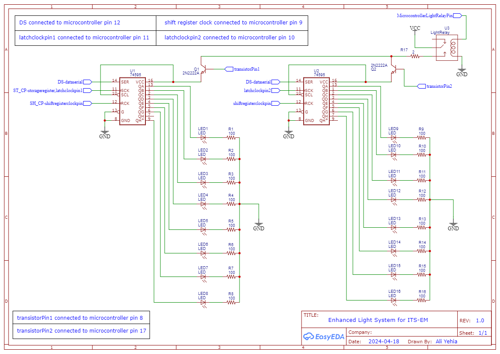

# ITS-EM (Intelligent Transport Systems Emulation Module)

## Project Description
ITS-EM is a project that aims to emulate intelligent transport systems using various sensors and actuators. It includes functionalities such as motion detection, vehicle counting, and controlling a light system based on the detected motion and vehicle count.

## Documentation
For detailed documentation, please refer to the [documentation](documentation_link_here).

## Schematic for Light System

