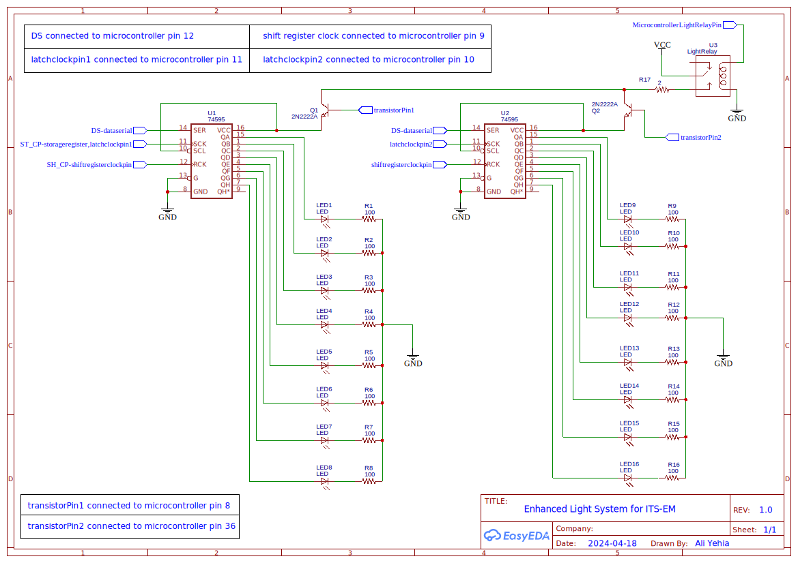

# Intelligent Transport Systems Emulation Module (ITS-EM)

## Project Description
ITS-EM is a comprehensive project that simulates intelligent transport systems through the integration of diverse sensors and actuators. This system encompasses a range of functionalities, including fire suppression, automatic tolling, lighting control, weather monitoring, and truck weighing management systems. Additionally, it leverages computer vision and AI technologies for traffic monitoring and violation detection, enhancing overall transportation management and safety.

## Role and Contributions in the ITS-EM Project
My role in the ITS-EM project was dynamic and multifaceted. I spearheaded the quest for innovative tools and methodologies, striving to craft the most effective strategies for implementing the project's core functions. I conceptualized and meticulously planned the five systems at the project's core, carefully selecting the materials essential for their construction.

I immersed myself in the intricacies of system simulations, ensuring that each component seamlessly integrated with the others. From hardware configuration to coding, I was responsible for integrating the code for the entire system to function together. I took charge of the project's technical aspects, focusing on creating a coherent and easily maintainable system.

My involvement extended to the deployment of AI and computer vision technologies, enriching the project's capabilities. Additionally, I undertook the monumental task of documenting the project's journey. This involved delving into a vast array of literature, meticulously reviewing papers, and distilling complex concepts into the comprehensive ITS-EM Formal Report.

## Documentation
For detailed documentation, please refer to the [documentation](Documents/ITS-EM_Graduation_Book.pdf).

## Schematic for Enhanced Light System

## Computer Vision and AI

